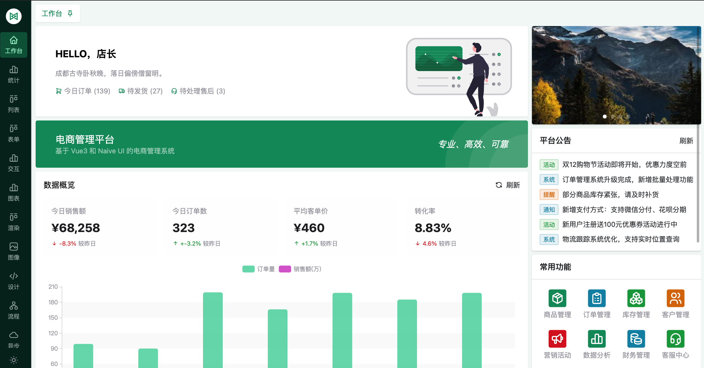
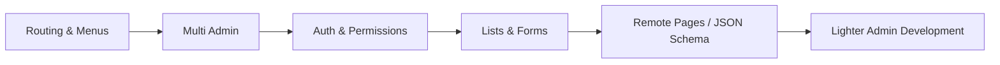

<div align="center">

# DVHA


**A lighter, less-build Vue admin framework**

_Built for admin projects with many pages, many roles, multiple back offices, and dynamic extension needs_

[](https://www.npmjs.com/package/@duxweb/dvha-core)
[](https://opensource.org/licenses/MIT)
[](http://www.typescriptlang.org/)

📖 **[Documentation](https://dvha.docs.dux.plus/)** | 🌟 **[UI Demo](https://duxweb.github.io/dvha/start)** | 🚀 **[Quick Start](#quick-start)** | 🇨🇳 **[中文](./README.md)**

</div>

---



## What is DVHA?

**DVHA is a Vue framework built for admin applications.**

Its biggest advantage is not just “more components”, but this:

- **less rebuild in many real-world admin scenarios**
- **multi-admin is built in**
- **remote pages, async menus, and JSON Schema are first-class citizens**
- **it does not lock you into one UI library**

Many traditional frontend admin solutions become heavier over time:

- change a page, wait for rebuilds
- split multiple admin apps by hand
- remote pages and dynamic pages are hard to plug in
- extensions become expensive as the project grows

DVHA is designed to make those parts lighter.

## Why DVHA

### 1. Less rebuild in many scenarios

DVHA supports:

- remote pages
- async menus
- JSON Schema rendering
- multi-admin configuration-driven architecture

That means many parts do not have to be hardcoded and rebuilt every time.

### 2. Multi-admin is built in

DVHA treats multi-admin as a built-in capability from day one.

A single project can host multiple admin areas such as:

- `/admin`
- `/merchant`
- `/user`
- `/agent`

And each one can have its own:

- route prefix
- menus
- auth flow
- API prefix
- theme
- dynamic extensions

### 3. UI-agnostic by design

DVHA follows a headless approach and does not force one UI library.

You can combine it with:

- Naive UI
- Element Plus
- your own business components
- the Pro package

### 4. Better fit for day-to-day admin work

DVHA is focused on the repetitive parts of admin systems:

- authentication
- permissions
- routing
- menus
- lists
- forms
- detail pages
- dynamic pages
- multi-role admin apps

## Key features

- 🎯 **Less build, lighter admin development**
- 🏢 **Built-in multi-admin architecture**
- 🧩 **UI-agnostic and flexible**
- ☁️ **Remote pages and async menus**
- 🧱 **JSON Schema rendering support**
- 🔐 **Auth, permissions, routing, and data foundations included**
- 📘 **Full TypeScript support**

## How DVHA fits admin development


```mermaid
flowchart LR
    A[Routing & Menus] --> B[Multi Admin]
    B --> C[Auth & Permissions]
    C --> D[Lists & Forms]
    D --> E[Remote Pages / JSON Schema]
    E --> F[Lighter Admin Development]
```

A simple way to think about DVHA:

- build the admin foundation first
- organize pages by admin area
- connect business flows on top of lists, forms, permissions, and remote pages
- extend the project without rebuilding the whole admin structure every time

## Core vs Pro

### Choose `@duxweb/dvha-core`

Best when you:

- want more flexibility
- already have your own design system or UI kit
- prefer building the page layer yourself
- only need the admin foundation layer

### Choose `@duxweb/dvha-pro`

Best when you:

- want to ship admin projects faster
- do not want to rebuild login pages, layouts, and error pages again
- want a more complete admin UI layer out of the box
- want to spend more time on business features than scaffolding

The simplest way to think about it:

- `Core` is the foundation
- `Pro` is the more complete admin UI layer on top of it

### Core / Pro comparison

| Comparison | Core | Pro |
| --- | --- | --- |
| Positioning | Admin foundation layer | Admin enhancement and delivery layer |
| Getting started | More flexible, more assembly by yourself | Faster, more ready out of the box |
| UI layer | More freedom | More complete |
| Base admin pages | You build more yourself | More ready-made pages included |
| Best for | Teams prioritizing flexibility | Teams prioritizing delivery speed |
| Multi-admin | ✅ | ✅ |
| Remote pages / JSON Schema | ✅ | ✅ |
| Recommended when | You already have your own design system | You want a complete admin faster |

## Quick Start

### Install Core

```bash
# npm
npm install @duxweb/dvha-core

# yarn
yarn add @duxweb/dvha-core

# pnpm
pnpm add @duxweb/dvha-core
```

### Minimal example

```ts
import type { IConfig } from '@duxweb/dvha-core'
import { createDux, simpleAuthProvider, simpleDataProvider } from '@duxweb/dvha-core'
import { createApp } from 'vue'
import App from './App.vue'

const app = createApp(App)

const config: IConfig = {
  defaultManage: 'admin',
  manages: [
    {
      name: 'admin',
      title: 'DVHA Admin System',
      routePrefix: '/admin',
      routes: [
        {
          name: 'admin.login',
          path: 'login',
          component: () => import('./pages/login.vue'),
          meta: { authorization: false },
        },
      ],
      menus: [
        {
          name: 'home',
          path: 'index',
          icon: 'i-tabler:home',
          label: 'Home',
          component: () => import('./pages/home.vue'),
        },
      ],
    },
  ],
  dataProvider: simpleDataProvider({
    apiUrl: 'https://api.example.com',
  }),
  authProvider: simpleAuthProvider(),
}

app.use(createDux(config))
app.mount('#app')
```

## If you want to move faster

If you want to avoid rebuilding common admin pages, go straight to `DVHA Pro`:

- complete admin layouts
- login page
- error pages
- high-frequency components such as tables, forms, dialogs, and drawers
- a better starting point for real business pages

Docs:

- [Why Pro](https://dvha.docs.dux.plus/pro/)
- [Core vs Pro](https://dvha.docs.dux.plus/pro/choose)
- [Pro Getting Started](https://dvha.docs.dux.plus/pro/getting-started)

## Best fit projects

DVHA is especially suitable for:

- admin panels
- merchant back offices
- operations dashboards
- multi-role admin systems
- admin projects with many pages and many roles
- projects that need remote pages, dynamic pages, or configuration-driven pages

## Documentation

- [Why DVHA](https://dvha.docs.dux.plus/guide/overview)
- [Quick Start](https://dvha.docs.dux.plus/guide/started)
- [Project Configuration](https://dvha.docs.dux.plus/guide/config)
- [Custom Extensions](https://dvha.docs.dux.plus/guide/custom-extension)
- [Remote Components & Micro Frontends](https://dvha.docs.dux.plus/pro/course/remote)
- [JSON Schema](https://dvha.docs.dux.plus/hooks/advanced/useJson)

## One-line summary

**DVHA is a strong fit for Vue admin projects with many pages, many roles, multiple admin areas, and dynamic extension requirements.**

Its biggest strength is not one single component, but that it makes the heaviest, most repetitive parts of admin development lighter.
