# DVHA

<div align="center">


**🚀 Frontend solution for easily building admin management systems**

*A Vue 3-based headless admin framework*

[](https://www.npmjs.com/package/@duxweb/dvha-core)
[](https://opensource.org/licenses/LGPL-3.0)
[](http://www.typescriptlang.org/)

📖 **[Full Documentation](https://duxweb.github.io/dvha/)** | 🌟 **[Live Demo](https://duxweb.github.io/dvha/demo)** | 🎯 **[Quick Start](#quick-start)** | 🇨🇳 **[中文文档](./README.md)**

</div>

---

## 📖 Introduction

DVHA (Dux Vue Headless Admin) is a Vue 3-based headless admin frontend development framework. By decoupling business logic from the UI presentation layer, it focuses on frontend multi-tenant management, authentication, permissions, CRUD, I18n and other business logic processing. It can be combined with any Vue ecosystem UI framework, allowing developers to focus on business implementation without worrying about UI framework selection and integration.

## ✨ Key Features

<table>
<tr>
<td>

### 🎨 UI Framework Agnostic
Seamlessly integrate with any Vue ecosystem UI framework
- Element Plus
- Ant Design Vue
- Naive UI
- Other Vue UI frameworks

</td>
<td>

### 🏢 Enterprise Multi-tenant
Built-in multiple admin support
- Main backend management
- Sub-application backend
- Merchant backend
- Multi-tenant architecture

</td>
</tr>
<tr>
<td>

### 🔑 Unified Authentication
Complete authentication process and permission management
- Multiple authentication methods
- Fine-grained permission control
- Route guards
- Permission verification

</td>
<td>

### 🚀 Out-of-the-box CRUD
Rich hooks and utility functions
- Automatic data processing
- State management
- Form validation
- Repetitive work automation

</td>
</tr>
<tr>
<td>

### 🌐 Internationalization
Built-in I18n support
- Multi-language applications
- Global business
- Language switching
- Localization adaptation

</td>
<td>

### 📘 Full TypeScript
100% TypeScript development
- Complete type hints
- Type safety
- Better development experience
- Code quality assurance

</td>
</tr>
</table>

## 🏗️ Architecture Design

```mermaid
flowchart TD
    subgraph AppLayer["🏢 Application Layer (Multi-tenant)"]
        MainAdmin["🎯 Main Admin"]
        OtherAdmin["🔧 Other Admin"]
    end

    subgraph CoreLayer["⚡ @duxweb/dvha-core Core Layer"]
        Router["🧭 Router Management"]
        StateManagement["💾 State Management"]
        UserAuth["🔐 User Authentication"]
        DataProcessing["📊 Data Processing"]
        ConfigCenter["⚙️ Config Center"]
        CommonComponents["🧩 Common Components"]
        UIHook["📺 UI Hook"]
    end

    subgraph UILayer["🎨 UI Framework Layer (Mix & Match)"]
        Element["Element Plus"]
        Ant["Antd Design"]
        Naive["Naive UI"]
        Others["Other UI Frameworks"]
    end

    AppLayer --> CoreLayer
    CoreLayer --> UILayer

    style AppLayer fill:#e1f5fe
    style CoreLayer fill:#f3e5f5
    style UILayer fill:#e8f5e8
```



## 📦 Core Package @duxweb/dvha-core

`@duxweb/dvha-core` is the core package of DVHA, providing the basic functionality of the framework:

### 🔧 Core Components

| Component | Description |
|-----------|-------------|
| 🧭 **Router Management** | Vue Router-based routing management with permission control and route guards |
| 💾 **State Management** | Pinia-based state management with persistent storage support |
| 🔐 **Authentication Module** | Complete user authentication process including login, registration, permission verification, etc. |
| 📊 **Data Processing** | Provides data CRUD related hooks and utility functions |
| ⚙️ **Config Center** | Unified application configuration management |
| 📺 **UI Hook** | Hook functions for some UI libraries to easily integrate data interaction |

## 🚀 Quick Start

### Installation

```bash
# Using npm
npm install @duxweb/dvha-core

# Using yarn
yarn add @duxweb/dvha-core

# Using pnpm
pnpm add @duxweb/dvha-core
```

### Basic Usage

```typescript
import { createDux } from '@duxweb/dvha-core'
import { createApp } from 'vue'
import App from './App.vue'

const app = createApp(App)

// Create Dux instance
const dux = createDux({
  // API base path
  baseUrl: '/api',
  // App configuration
  app: {
    name: 'My Admin App',
    version: '1.0.0'
  },
  // Auth configuration
  auth: {
    loginPath: '/login',
    homePath: '/dashboard'
  }
  // Other configurations...
})

// Use Dux
app.use(dux)
app.mount('#app')
```

### Advanced Example

```typescript
import { createDux } from '@duxweb/dvha-core'
import { createApp } from 'vue'
import App from './App.vue'

const app = createApp(App)

const dux = createDux({
  baseUrl: process.env.VUE_APP_API_BASE_URL || '/api',

  // Multi-tenant configuration
  tenant: {
    enabled: true,
    key: 'tenant_id',
    storage: 'localStorage'
  },

  // Authentication configuration
  auth: {
    loginPath: '/login',
    homePath: '/dashboard',
    tokenKey: 'access_token',
    refreshTokenKey: 'refresh_token',
    autoRefresh: true
  },

  // Permission configuration
  permission: {
    mode: 'route', // 'route' | 'function' | 'both'
    cache: true,
    cacheKey: 'user_permissions'
  },

  // Internationalization
  i18n: {
    locale: 'en',
    fallbackLocale: 'en',
    messages: {
      en: () => import('./locales/en.json'),
      zh: () => import('./locales/zh.json')
    }
  }
})

app.use(dux)
app.mount('#app')
```

### More Examples

Check out the [Full Documentation](https://duxweb.github.io/dvha/) for more usage examples and advanced configurations.

## 📚 Related Packages

| Package | Description | Version |
|---------|-------------|---------|
| `@duxweb/dvha-core` | Core functionality package | [](https://www.npmjs.com/package/@duxweb/dvha-core) |
| `@duxweb/dvha-naiveui` | Naive UI enhancement package | [](https://www.npmjs.com/package/@duxweb/dvha-naiveui) |
| `@duxweb/dvha-elementui` | Element Plus enhancement package | [](https://www.npmjs.com/package/@duxweb/dvha-elementui) |

## 🤝 Contributing

We welcome all contributions! Please check out the [Contributing Guide](https://duxweb.github.io/dvha/contributing) to learn how to get started.

### Development Setup

```bash
# Clone the repository
git clone https://github.com/duxweb/dvha.git
cd dvha

# Install dependencies
npm install

# Start development server
npm run dev

# Run tests
npm run test

# Build for production
npm run build
```

## 📄 License

This project is licensed under the [LGPL-3.0](https://opensource.org/licenses/LGPL-3.0) License.

---

<div align="center">

**🎉 Thank you for using DVHA!**

If this project helps you, please give us a ⭐️

[📖 Documentation](https://duxweb.github.io/dvha/) • [🐛 Report Issues](https://github.com/duxweb/dvha/issues) • [💡 Feature Requests](https://github.com/duxweb/dvha/discussions)

</div>