<div align="center">

# DVHA

</div>

<div align="center">


**🚀 Frontend solution for easily building admin management systems**

*A Vue 3-based headless admin framework*

[](https://www.npmjs.com/package/@duxweb/dvha-core)
[](https://opensource.org/licenses/LGPL-3.0)
[](http://www.typescriptlang.org/)

📖 **[Full Documentation](https://duxweb.github.io/dvha/)** | 🌟 **[Live Demo](https://duxweb.github.io/dvha/demo)** | 🎯 **[Quick Start](#quick-start)** | 🇨🇳 **[中文文档](./README.md)**

</div>

---

## 📖 Introduction

DVHA (Dux Vue Headless Admin) is a Vue 3-based headless admin frontend development framework. By decoupling business logic from the UI presentation layer, it focuses on frontend multi-tenant management, authentication, permissions, CRUD, I18n and other business logic processing. It can be combined with any Vue ecosystem UI framework, allowing developers to focus on business implementation without worrying about UI framework selection and integration.

## ✨ Key Features

- 🎨 **UI Framework Agnostic** - Seamlessly integrate with any Vue ecosystem UI framework (Element Plus, Ant Design Vue, Naive UI, etc.)
- 🏢 **Enterprise Multi-tenant** - Built-in multiple admin support for main backend, sub-application backend, merchant backend and multi-tenant architecture
- 🔑 **Unified Authentication** - Complete authentication process and permission management with multiple authentication methods and fine-grained permission control
- 🚀 **Out-of-the-box CRUD** - Rich hooks and utility functions for automatic data processing and state management
- 🌐 **Internationalization** - Built-in I18n support for easy multi-language applications and global business
- 📘 **Full TypeScript** - 100% TypeScript development with complete type hints and better development experience

## 🏗️ Architecture Design

```mermaid
flowchart TD
    subgraph AppLayer["🏢 Application Layer (Multi-tenant)"]
        MainAdmin["🎯 Main Admin"]
        OtherAdmin["🔧 Other Admin"]
    end

    subgraph CoreLayer["⚡ @duxweb/dvha-core Core Layer"]
        Router["🧭 Router Management"]
        StateManagement["💾 State Management"]
        UserAuth["🔐 User Authentication"]
        DataProcessing["📊 Data Processing"]
        ConfigCenter["⚙️ Config Center"]
        CommonComponents["🧩 Common Components"]
        UIHook["📺 UI Hook"]
    end

    subgraph UILayer["🎨 UI Framework Layer (Mix & Match)"]
        Element["Element Plus"]
        Ant["Antd Design"]
        Naive["Naive UI"]
        Others["Other UI Frameworks"]
    end

    AppLayer --> CoreLayer
    CoreLayer --> UILayer

    style AppLayer fill:#e1f5fe
    style CoreLayer fill:#f3e5f5
    style UILayer fill:#e8f5e8
```



## 📦 Core Package @duxweb/dvha-core

`@duxweb/dvha-core` is the core package of DVHA, providing the basic functionality of the framework:

### 🔧 Core Components

| Component Module | Feature Description |
|:---:|:---|
| 🧭 **Router Management** | Vue Router-based routing management with permission control and route guards |
| 💾 **State Management** | Pinia-based state management with persistent storage support |
| 🔐 **Authentication Module** | Complete user authentication process including login, registration, permission verification, etc. |
| 📊 **Data Processing** | Provides data CRUD related hooks and utility functions |
| ⚙️ **Config Center** | Unified application configuration management |
| 📺 **UI Hook** | Hook functions for some UI libraries to easily integrate data interaction |

## 🚀 Quick Start

### Installation

```bash
# Using npm
npm install @duxweb/dvha-core

# Using yarn
yarn add @duxweb/dvha-core

# Using pnpm
pnpm add @duxweb/dvha-core
```

### Basic Usage

```typescript
import type { IConfig } from '@duxweb/dvha-core'
import { createDux, simpleDataProvider, simpleAuthProvider } from '@duxweb/dvha-core'
import { createApp } from 'vue'
import App from './App.vue'

const app = createApp(App)

const config: IConfig = {
  apiUrl: 'https://api.example.com', // Replace with your API address
  defaultManage: 'admin',
  manages: [
    {
      name: 'admin',
      title: 'DVHA Admin Management System',
      routePrefix: '/admin',
      apiUrl: '/admin',
      components: {
        authLayout: () => import('./pages/layout.vue'),
        notFound: () => import('./pages/404.vue'),
      },
      routes: [
        {
          name: 'admin.login',
          path: 'login',
          component: () => import('./pages/login.vue'),
          meta: {
            authorization: false,
          }
        },
      ],
      menus: [
        {
          name: 'home',
          path: 'index',
          icon: 'i-tabler:home',
          label: 'Home',
          component: () => import('./pages/home.vue'),
        },
        {
          name: 'users',
          path: 'users',
          icon: 'i-tabler:users',
          label: 'User Management',
          component: () => import('./pages/home.vue'),
        },
        {
          name: 'settings',
          path: 'settings',
          icon: 'i-tabler:settings',
          label: 'System Settings',
          component: () => import('./pages/home.vue'),
        },
      ]
    },
  ],
  dataProvider: simpleDataProvider,
  authProvider: simpleAuthProvider,
}

app.use(createDux(config))
app.mount('#app')
```

### Advanced Example (Multi-tenant)

```typescript
import type { IConfig } from '@duxweb/dvha-core'
import { createDux, simpleDataProvider, simpleAuthProvider } from '@duxweb/dvha-core'
import { createApp } from 'vue'
import App from './App.vue'

const app = createApp(App)

const config: IConfig = {
  // Global configuration
  title: 'Enterprise Admin Platform',
  copyright: '© 2024 Enterprise Corp',
  apiUrl: 'https://api.enterprise.com',

  defaultManage: 'admin',

  manages: [
    // System management
    {
      name: 'admin',
      title: 'System Management',
      routePrefix: '/admin',
      apiUrl: '/admin',

      // Feature toggles
      register: false,
      forgotPassword: true,
      updatePassword: true,

      // Remote menu loading
      apiRoutePath: '/admin/menus',

      // Layout components
      components: {
        authLayout: () => import('./layouts/AdminLayout.vue'),
        noAuthLayout: () => import('./layouts/LoginLayout.vue'),
        notFound: () => import('./pages/404.vue'),
        notAuthorized: () => import('./pages/403.vue')
      },

      // Authentication routes
      routes: [
        {
          name: 'admin.login',
          path: 'login',
          component: () => import('./pages/admin/Login.vue'),
          meta: { authorization: false }
        },
        {
          name: 'admin.register',
          path: 'register',
          component: () => import('./pages/admin/Register.vue'),
          meta: { authorization: false }
        }
      ],

      // Local menus
      menus: [
        {
          name: 'dashboard',
          path: 'dashboard',
          icon: 'i-tabler:dashboard',
          label: 'Dashboard',
          component: () => import('./pages/admin/Dashboard.vue')
        },
        {
          name: 'users',
          path: 'users',
          icon: 'i-tabler:users',
          label: 'User Management',
          component: () => import('./pages/admin/Users.vue'),
          meta: { permissions: ['user.read'] }
        },
        {
          name: 'system',
          path: 'system',
          icon: 'i-tabler:settings',
          label: 'System Settings',
          component: () => import('./pages/admin/System.vue')
        }
      ],

      // Theme configuration
      theme: {
        logo: '/admin-logo.png',
        banner: '/admin-banner.jpg'
      }
    },

    // User center
    {
      name: 'user',
      title: 'User Center',
      routePrefix: '/user',
      apiUrl: '/user',

      // Enable user registration
      register: true,
      forgotPassword: true,

      components: {
        authLayout: () => import('./layouts/UserLayout.vue'),
        noAuthLayout: () => import('./layouts/UserLoginLayout.vue')
      },

      routes: [
        {
          name: 'user.login',
          path: 'login',
          component: () => import('./pages/user/Login.vue'),
          meta: { authorization: false }
        }
      ],

      menus: [
        {
          name: 'profile',
          path: 'profile',
          icon: 'i-tabler:user',
          label: 'My Profile',
          component: () => import('./pages/user/Profile.vue')
        },
        {
          name: 'orders',
          path: 'orders',
          icon: 'i-tabler:shopping-cart',
          label: 'My Orders',
          component: () => import('./pages/user/Orders.vue')
        }
      ]
    }
  ],

  // Global providers
  dataProvider: simpleDataProvider,
  authProvider: simpleAuthProvider,
}

app.use(createDux(config))
app.mount('#app')
```

### More Examples

Check out the [Full Documentation](https://duxweb.github.io/dvha/) for more usage examples and advanced configurations.

## 📚 Related Packages

| Package Name | Package Description | Latest Version |
|:---|:---|:---:|
| `@duxweb/dvha-core` | 🯠Core functionality package - Provides framework basic capabilities | [](https://www.npmjs.com/package/@duxweb/dvha-core) |
| `@duxweb/dvha-naiveui` | 🨠Naive UI enhancement package - Integrates Naive UI | [](https://www.npmjs.com/package/@duxweb/dvha-naiveui) |
| `@duxweb/dvha-elementui` | 🨠Element Plus enhancement package - Integrates Element Plus | [](https://www.npmjs.com/package/@duxweb/dvha-elementui) |

## 🤝 Contributing

We welcome all contributions! Please check out the [Contributing Guide](https://duxweb.github.io/dvha/contributing) to learn how to get started.

### Development Setup

```bash
# Clone the repository
git clone https://github.com/duxweb/dvha.git
cd dvha

# Install dependencies
npm install

# Start development server
npm run dev

# Run tests
npm run test

# Build for production
npm run build
```

## 📄 License

This project is licensed under the [LGPL-3.0](https://opensource.org/licenses/LGPL-3.0) License.

---

<div align="center">

**🎉 Thank you for using DVHA!**

If this project helps you, please give us a ⭐️

[📖 Documentation](https://duxweb.github.io/dvha/) • [🐛 Report Issues](https://github.com/duxweb/dvha/issues) • [💡 Feature Requests](https://github.com/duxweb/dvha/discussions)

</div>