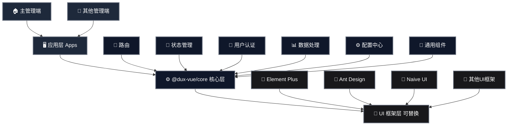

# Dux Vue Headless Admin

Dux Vue 是一款与 UI 无关的中后台前端框架，专注于多管理端、认证、权限、CURD、I18n等业务逻辑部分处理，可以搭配任何 Vue 生态的 UI 框架。

## 简介

Dux Vue Headless Admin 是一个基于 Vue 3 的无头（Headless）管理后台开发框架，主要特点是将业务逻辑与 UI 表现层解耦，使开发者可以专注于业务逻辑的实现，而不必担心 UI 的具体实现。

### 主要特性

- **UI 框架无关**：可以与任何 Vue 生态的 UI 框架（如 Element Plus、Ant Design Vue、Naive UI 等）集成
- **多管理端支持**：适用于构建多个管理端应用，如主后台、子应用后台、商户后台等
- **统一认证**：内置完整的认证流程和权限管理
- **CRUD 操作简化**：提供丰富的 hooks 和工具函数，简化数据增删改查操作
- **国际化支持**：内置 I18n 支持
- **TypeScript 支持**：完全使用 TypeScript 开发，提供良好的类型提示

## 核心包 @dux-vue/core

`@dux-vue/core` 是 Dux Vue 的核心包，提供了框架的基础功能：

### 核心组件

- **路由管理** 🧭：基于 Vue Router 的路由管理，支持权限控制和路由守卫
- **状态管理** 💾：基于 Pinia 的状态管理，支持持久化存储
- **认证模块** 🔐：完整的用户认证流程，包括登录、注册、权限验证等
- **数据处理** 📊：提供数据 CRUD 相关的 hooks 和工具函数
- **配置中心** ⚙️：统一的应用配置管理

### 架构图



## 快速开始

```bash
# 安装核心包
npm install @dux-vue/core

# 安装相关依赖
npm install vue vue-router pinia
```

## 使用示例

```typescript
import { createDux } from '@dux-vue/core'
import { createApp } from 'vue'
import App from './App.vue'

const app = createApp(App)

// 创建 Dux 实例
const dux = createDux({
  // 配置项
  baseUrl: '/api',
  // 其他配置...
})

// 使用 Dux
app.use(dux)
app.mount('#app')
```

## 相关包

- `@dux-vue/core` ⚙️: 核心功能包
- `@dux-vue/table` 📋: 表格数据处理工具

## 开源协议

LGPL-3.0
