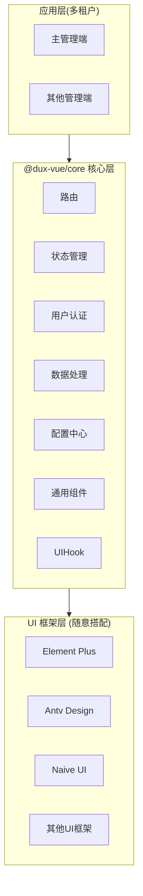

# Dux Vue Headless Admin

Dux Vue 是一款基于 Vue 3 的无头（Headless）中后台前端开发框架，通过将业务逻辑与 UI 表现层解耦，专注于前端的多管理端、认证、权限、CRUD、I18n等业务逻辑处理，可以搭配任何 Vue 生态的 UI 框架，使开发者专注于业务实现而不必关注 UI 框架的选择与整合。

### 主要特性

- 🎨 **UI 框架无关**：可以与任何 Vue 生态的 UI 框架（如 Element Plus、Ant Design Vue、Naive UI 等）集成
- 🏢 **多管理端支持**：适用于构建多个管理端应用，如主后台、子应用后台、商户后台等
- 🔑 **统一认证**：内置完整的认证流程和权限管理
- 📝 **CRUD 操作简化**：提供丰富的 hooks 和工具函数，简化数据增删改查操作
- 🌐 **国际化支持**：内置 I18n 支持
- 📘 **TypeScript 支持**：完全使用 TypeScript 开发，提供良好的类型提示

### 架构图



## 核心包 @dux-vue/core

`@dux-vue/core` 是 Dux Vue 的核心包，提供了框架的基础功能：

### 核心组件

- 🧭 **路由管理**：基于 Vue Router 的路由管理，支持权限控制和路由守卫
- 💾 **状态管理**：基于 Pinia 的状态管理，支持持久化存储
- 🔐 **认证模块**：完整的用户认证流程，包括登录、注册、权限验证等
- 📊 **数据处理**：提供数据 CRUD 相关的 hooks 和工具函数
- ⚙️ **配置中心**：统一的应用配置管理
- 📺 **UI Hook**：针对部分 UI 库提供 hook 功能来轻松整合数据交互

## 快速开始

```bash
# 安装核心包
npm install @dux-vue/core

```

## 使用示例

```typescript
import { createDux } from '@dux-vue/core'
import { createApp } from 'vue'
import App from './App.vue'

const app = createApp(App)

// 创建 Dux 实例
const dux = createDux({
  // 配置项
  baseUrl: '/api',
  // 其他配置...
})

// 使用 Dux
app.use(dux)
app.mount('#app')
```

## 相关包

- `@dux-vue/core`: 核心功能包
- `@dux-vue/naiveui`: Naive UI 增强包
- `@dux-vue/elmentui`: Elment Plus 增强包

## 开源协议

LGPL-3.0
