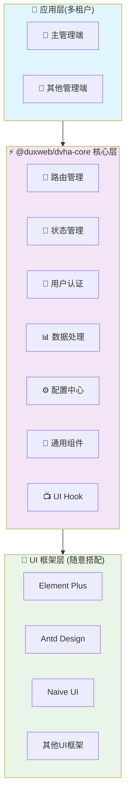

<div align="center">

# DVHA

</div>

<div align="center">


**🚀 轻松搭建中后台管理系统的前端解决方案**

_一个基于 Vue 3 的无头（Headless）中后台框架_

[](https://www.npmjs.com/package/@duxweb/dvha-core)
[](https://opensource.org/licenses/MIT)
[](http://www.typescriptlang.org/)

📖 **[查看完整文档](https://dvha.docs.dux.plus/)** | 🌟 **[UI集成演示](https://duxweb.github.io/dvha/start)** | 🎯 **[快速开始](#快速开始)** | 🇺🇸 **[English](./README.en.md)**

</div>

---

## 📖 项目介绍

DVHA (Dux Vue Headless Admin) 是一款基于 Vue 3 的无头（Headless）中后台前端开发框架。通过将业务逻辑与 UI 表现层解耦，专注于前端的多管理端、认证、权限、CRUD、I18n等业务逻辑处理，可以搭配任何 Vue 生态的 UI 框架，使开发者专注于业务实现而不必关注 UI 框架的选择与整合。

## ✨ 主要特性

- 🎨 **UI 框架无关** - 可与任何 Vue 生态 UI 框架集成（Element Plus、Ant Design Vue、Naive UI 等）
- 🏢 **企业级多租户** - 内置多管理端支持，支持主后台、子应用后台、商户后台等多租户架构
- 🔑 **统一身份认证** - 完整的认证流程和权限管理，支持多种认证方式和细粒度权限控制
- 🚀 **开箱即用的 CRUD** - 提供丰富的 hooks 和工具函数，自动化数据处理和状态管理
- 🌐 **国际化支持** - 内置 I18n 支持，轻松实现多语言应用和全球化业务
- 📘 **完整 TypeScript** - 100% TypeScript 开发，提供完整类型提示和更好的开发体验

## 🏗️ 架构设计



## 📦 核心包 @duxweb/dvha-core

`@duxweb/dvha-core` 是 DVHA 的核心包，提供了框架的基础功能：

### 🔧 核心组件

|    组件模块     | 功能描述                                           |
| :-------------: | :------------------------------------------------- |
| 🧭 **路由管理** | 基于 Vue Router 的路由管理，支持权限控制和路由守卫 |
| 💾 **状态管理** | 基于 Pinia 的状态管理，支持持久化存储              |
| 🔐 **认证模块** | 完整的用户认证流程，包括登录、注册、权限验证等     |
| 📊 **数据处理** | 提供数据 CRUD 相关的 hooks 和工具函数              |
| ⚙️ **配置中心** | 统一的应用配置管理                                 |
| 📺 **UI Hook**  | 针对部分 UI 库提供 hook 功能来轻松整合数据交互     |

## 🚀 快速开始

### 安装

```bash
# 使用 npm
npm install @duxweb/dvha-core

# 使用 yarn
yarn add @duxweb/dvha-core

# 使用 pnpm
pnpm add @duxweb/dvha-core
```

### 基础使用

```typescript
import type { IConfig } from '@duxweb/dvha-core'
import { createDux, simpleAuthProvider, simpleDataProvider } from '@duxweb/dvha-core'
import { createApp } from 'vue'
import App from './App.vue'

const app = createApp(App)

const config: IConfig = {
  defaultManage: 'admin',
  manages: [
    {
      name: 'admin',
      title: 'DVHA 后台管理系统',
      routePrefix: '/admin',
      components: {
        authLayout: () => import('./pages/layout.vue'),
        notFound: () => import('./pages/404.vue'),
      },
      routes: [
        {
          name: 'admin.login',
          path: 'login',
          component: () => import('./pages/login.vue'),
          meta: {
            authorization: false,
          }
        },
      ],
      menus: [
        {
          name: 'home',
          path: 'index',
          icon: 'i-tabler:home',
          label: '首页',
          component: () => import('./pages/home.vue'),
        },
        {
          name: 'users',
          path: 'users',
          icon: 'i-tabler:users',
          label: '用户管理',
          component: () => import('./pages/home.vue'),
        },
        {
          name: 'settings',
          path: 'settings',
          icon: 'i-tabler:settings',
          label: '系统设置',
          component: () => import('./pages/home.vue'),
        },
      ]
    },
  ],
  dataProvider: simpleDataProvider({
    apiUrl: 'https://api.example.com' // 替换为你的 API 地址
  }),
  authProvider: simpleAuthProvider(),
}

app.use(createDux(config))
app.mount('#app')
```

### 多数据源配置

```typescript
import type { IConfig } from '@duxweb/dvha-core'
import { simpleAuthProvider, simpleDataProvider } from '@duxweb/dvha-core'

const config: IConfig = {
  title: '企业管理平台',
  defaultManage: 'admin',

  // 全局多数据源配置
  dataProvider: {
    default: simpleDataProvider({
      apiUrl: 'https://api.example.com'
    }),
    analytics: simpleDataProvider({
      apiUrl: 'https://analytics-api.example.com'
    }),
    payment: simpleDataProvider({
      apiUrl: 'https://payment-api.example.com'
    }),
    logistics: simpleDataProvider({
      apiUrl: 'https://logistics-api.example.com'
    })
  },

  manages: [
    {
      name: 'admin',
      title: '后台管理',
      routePrefix: '/admin',

      // 管理端可以覆盖特定数据源
      dataProvider: {
        default: simpleDataProvider({
          apiUrl: 'https://admin-api.example.com'
        }),
        // 其他数据源从全局继承
      },

      // 自定义认证配置
      authProvider: simpleAuthProvider({
        apiPath: {
          login: '/admin/login',
          check: '/admin/check'
        },
        routePath: {
          login: '/admin/login',
          index: '/admin'
        }
      }),

      routes: [
        {
          name: 'admin.login',
          path: 'login',
          component: () => import('./pages/admin/Login.vue'),
          meta: { authorization: false }
        }
      ],

      menus: [
        {
          name: 'dashboard',
          path: 'dashboard',
          icon: 'i-tabler:dashboard',
          label: '仪表板',
          component: () => import('./pages/Dashboard.vue')
        }
      ]
    }
  ],

  authProvider: simpleAuthProvider(),
}
```

### 更多示例

查看 [完整文档](https://dvha.docs.dux.plus/) 获取更多使用示例和高级配置。

## 📚 相关包

| 包名                     | 包描述                                     |                                                        最新版本                                                         |
| :----------------------- | :----------------------------------------- | :---------------------------------------------------------------------------------------------------------------------: |
| `@duxweb/dvha-core`      | 🎯 核心功能包 - 提供框架基础能力           |      [](https://www.npmjs.com/package/@duxweb/dvha-core)      |
| `@duxweb/dvha-naiveui`   | 🎨 Naive UI 增强包 - 集成 Naive UI         |   [](https://www.npmjs.com/package/@duxweb/dvha-naiveui)   |
| `@duxweb/dvha-elementui` | 🎨 Element Plus 增强包 - 集成 Element Plus | [](https://www.npmjs.com/package/@duxweb/dvha-elementui) |

## AI 开发

本项目已索引 LLM 数据：

- [@duxweb/dvha-core](https://github.com/duxweb/dvha/raw/refs/heads/main/packages/core/llms-full.txt) - 核心功能包
- [@duxweb/dvha-pro](https://github.com/duxweb/dvha/raw/refs/heads/main/packages/pro/llms-full.txt) - 专业版组件包
- [@duxweb/dvha-naiveui](https://github.com/duxweb/dvha/raw/refs/heads/main/packages/naiveui/llms-full.txt) - Naive UI 集成包
- [完整项目](https://github.com/duxweb/dvha/raw/refs/heads/main/llms-full.txt) - 整个项目的完整索引

## 💬 加入社区

### 微信交流群

扫描下方二维码加入 DVHA 微信交流群，与更多开发者一起交流技术、分享经验：

<div align="center">
  
  <p><em>微信扫码加入交流群</em></p>
</div>

> 如果二维码过期，请添加微信号：`deak100` 备注「DVHA」拉你入群

## 📊 项目数据

### 🌟 项目趋势

[](https://star-history.com/#duxweb/dvha&Date)

### 💻 贡献者

感谢所有为 DVHA 做出贡献的开发者们！

<div align="center">

[](https://github.com/duxweb/dvha/graphs/contributors)

</div>

## 🤝 贡献

我们欢迎所有的贡献！请查看 [贡献指南](https://dvha.docs.dux.plus/contributing) 了解如何开始。

## 📄 开源协议

本项目基于 [MIT](https://opensource.org/licenses/MIT) 协议开源。

---

<div align="center">

**🎉 感谢使用 DVHA！**

如果这个项目对你有帮助，请给我们一个 ⭐️

[📖 文档](https://dvha.docs.dux.plus/) • [🐛 报告问题](https://github.com/duxweb/dvha/issues) • [💡 功能建议](https://github.com/duxweb/dvha/discussions)

</div>

<div align="center">

[本项目 CDN 加速及安全防护由 Tencent EdgeOne 赞助](https://edgeone.ai/zh?from=github)

<a href="https://edgeone.ai/zh?from=github">

</a>

</div>
