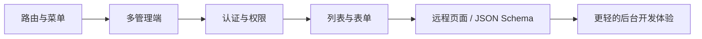

<div align="center">

# DVHA


**少编译、更灵活的 Vue 中后台框架**

_适合页面多、角色多、管理端多、需要动态扩展的后台项目_

[](https://www.npmjs.com/package/@duxweb/dvha-core)
[](https://opensource.org/licenses/MIT)
[](http://www.typescriptlang.org/)

📖 **[查看完整文档](https://dvha.docs.dux.plus/)** | 🌟 **[UI 集成演示](https://duxweb.github.io/dvha/start)** | 🚀 **[快速开始](#快速开始)** | 🇺🇸 **[English](./README.en.md)**

</div>

---


## 什么是 DVHA？

**DVHA 是一个更适合中后台开发的 Vue 框架。**

它最核心的特点不是“组件多”，而是：

- **很多场景下不用反复编译**
- **天然支持多管理端**
- **支持远程页面、异步菜单、JSON Schema**
- **不把 UI 方案绑死**

很多传统前端后台方案，做着做着会越来越重：

- 改一个页面就要等编译
- 多个后台要拆很多套结构
- 动态页面、远程页面接入麻烦
- 想扩展时改动范围越来越大

DVHA 想解决的就是这些问题。

## 为什么是 DVHA

### 1. 很多场景下少编译

DVHA 支持：

- 远程页面
- 异步菜单
- JSON Schema 动态渲染
- 多管理端配置驱动

这意味着很多内容不一定要全部写死在本地代码里再重新打包，后台开发会更轻。

### 2. 多管理端是内建能力

DVHA 从一开始就把多管理端当成内建能力来设计。

一个项目里可以同时有：

- `/admin`
- `/merchant`
- `/user`
- `/agent`

并且它们可以拥有各自独立的：

- 路由前缀
- 菜单
- 登录方式
- 接口前缀
- 主题
- 动态扩展能力

### 3. 不绑死 UI 库

DVHA 采用 Headless 思路，不强绑某个 UI 组件库。

你可以按项目需要组合：

- Naive UI
- Element Plus
- 自己的业务组件
- Pro 组件包

### 4. 更适合中后台日常开发

DVHA 更偏向解决中后台里反复出现的问题：

- 登录
- 权限
- 路由
- 菜单
- 列表
- 表单
- 详情
- 动态页面
- 多角色后台

## 核心特点

- 🎯 **少编译，更轻地做后台**
- 🏢 **多管理端内建**
- 🧩 **不绑死 UI，组合更自由**
- ☁️ **支持远程页面与异步菜单**
- 🧱 **支持 JSON Schema 动态渲染**
- 🔐 **内置认证、权限、路由、数据基础能力**
- 📘 **完整 TypeScript 支持**

## DVHA 适合怎么开发


```mermaid
flowchart LR
    A[路由与菜单] --> B[多管理端]
    B --> C[认证与权限]
    C --> D[列表与表单]
    D --> E[远程页面 / JSON Schema]
    E --> F[更轻的后台开发体验]
```

你可以把 DVHA 的开发方式理解成：

- 先把后台基础能力搭好
- 再按管理端组织页面
- 再按业务接表单、列表、权限、远程页面
- 需要扩展时，不必总是回到“重搭一套后台”

## Core 和 Pro 怎么选

### 选 `@duxweb/dvha-core`

适合你：

- 更在意灵活度
- 已经有自己的 UI / 设计体系
- 想自己搭页面层
- 只想要后台基础能力骨架

### 选 `@duxweb/dvha-pro`

适合你：

- 想更快把后台做出来
- 不想重复搭登录页、布局页、错误页
- 想直接拿到更完整的后台页面和组件能力
- 希望把时间放在业务，而不是重复搭基础设施

最简单理解：

- `Core` 是骨架
- `Pro` 是更完整的后台界面能力

### Core / Pro 对比表

| 对比项 | Core | Pro |
| --- | --- | --- |
| 定位 | 后台基础能力层 | 后台增强与落地层 |
| 上手方式 | 更灵活，自己拼装更多 | 更快，开箱即用更多 |
| UI 层 | 更自由 | 更完整 |
| 后台基础页面 | 需要自己补更多 | 已提供更多现成能力 |
| 适合谁 | 注重灵活度的团队 | 注重交付效率的团队 |
| 多管理端 | ✅ | ✅ |
| 远程页面 / JSON Schema | ✅ | ✅ |
| 推荐场景 | 已有设计体系、想深度自定义 | 想快速做出完整后台 |

## 快速开始

### 安装 Core

```bash
# npm
npm install @duxweb/dvha-core

# yarn
yarn add @duxweb/dvha-core

# pnpm
pnpm add @duxweb/dvha-core
```

### 最小示例

```ts
import type { IConfig } from '@duxweb/dvha-core'
import { createDux, simpleAuthProvider, simpleDataProvider } from '@duxweb/dvha-core'
import { createApp } from 'vue'
import App from './App.vue'

const app = createApp(App)

const config: IConfig = {
  defaultManage: 'admin',
  manages: [
    {
      name: 'admin',
      title: 'DVHA 后台管理系统',
      routePrefix: '/admin',
      routes: [
        {
          name: 'admin.login',
          path: 'login',
          component: () => import('./pages/login.vue'),
          meta: { authorization: false },
        },
      ],
      menus: [
        {
          name: 'home',
          path: 'index',
          icon: 'i-tabler:home',
          label: '首页',
          component: () => import('./pages/home.vue'),
        },
      ],
    },
  ],
  dataProvider: simpleDataProvider({
    apiUrl: 'https://api.example.com',
  }),
  authProvider: simpleAuthProvider(),
}

app.use(createDux(config))
app.mount('#app')
```

## 如果你想更快落地

如果你想少写很多后台基础页面，建议直接看 `DVHA Pro`：

- 更完整的后台布局
- 登录页
- 错误页
- 表格 / 表单 / 弹窗 / 抽屉等高频组件
- 更适合直接开始做业务页面

文档入口：

- [为什么用 Pro](https://dvha.docs.dux.plus/pro/)
- [Core 和 Pro 怎么选](https://dvha.docs.dux.plus/pro/choose)
- [Pro 快速开始](https://dvha.docs.dux.plus/pro/getting-started)

## 适合什么项目

DVHA 特别适合：

- 管理后台
- 商家后台
- 运营后台
- 多角色后台
- 页面多、角色多、管理端多的中后台项目
- 需要远程页面、动态页面、配置化页面的项目

## 文档入口

- [为什么 DVHA](https://dvha.docs.dux.plus/guide/overview)
- [快速开始](https://dvha.docs.dux.plus/guide/started)
- [项目配置](https://dvha.docs.dux.plus/guide/config)
- [自定义扩展](https://dvha.docs.dux.plus/guide/custom-extension)
- [远程组件与微前端](https://dvha.docs.dux.plus/pro/course/remote)
- [JSON Schema](https://dvha.docs.dux.plus/hooks/advanced/useJson)

## 一句话总结

**DVHA 适合用 Vue 做中后台，而且特别适合“页面多、角色多、管理端多、动态扩展多”的项目。**

它最大的优势不是某一个组件，而是：**把中后台里最麻烦、最重复、最容易越做越重的部分，尽量变轻。**
