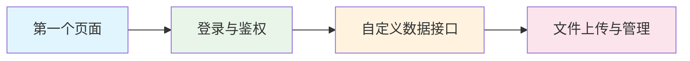
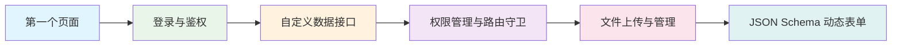
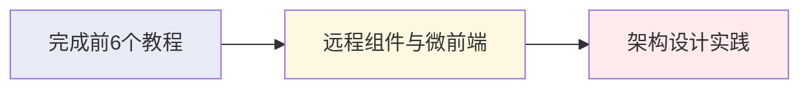

# DVHA Pro 教程总览

欢迎来到 DVHA Pro 的完整学习体系！本教程系列将带你从零开始，逐步掌握 DVHA Pro 的核心功能和高级特性。

## 🎯 学习目标

通过完整的教程学习，你将能够：

- 🚀 **快速上手** - 掌握 DVHA Pro 的基础使用方法
- 🔐 **用户认证** - 实现完整的登录、鉴权和权限管理
- 🌐 **数据交互** - 自定义数据接口，适配各种后端 API
- 📁 **文件处理** - 实现文件上传、管理和预览功能
- 🎨 **动态界面** - 使用 JSON Schema 构建配置驱动的界面
- 🏗️ **架构设计** - 掌握微前端和远程组件等高级架构

## 📚 教程路线图

### 🌟 基础入门（必学）

这些教程是 DVHA Pro 开发的基础，建议按顺序学习：

#### 1️⃣ [第一个页面](/pro/course/start)
- **学习时间**：30 分钟
- **难度等级**：⭐
- **核心内容**：项目初始化、创建第一个管理页面、基础路由配置
- **适合人群**：DVHA Pro 新手，想要快速上手的开发者

::: tip 为什么从这里开始？
这是最基础的教程，帮你建立对 DVHA Pro 的整体认知，创建第一个可运行的页面。
:::

#### 2️⃣ [登录与鉴权](/pro/course/login)
- **学习时间**：45 分钟
- **难度等级**：⭐⭐
- **核心内容**：用户登录、JWT 认证、登录状态管理、路由守卫
- **前置要求**：完成第一个页面教程

::: tip 为什么学习这个？
几乎所有管理系统都需要用户认证，这是构建真实应用的必备功能。
:::

#### 3️⃣ [自定义数据接口](/pro/course/api)
- **学习时间**：40 分钟
- **难度等级**：⭐⭐
- **核心内容**：数据提供者配置、API 格式适配、错误处理
- **前置要求**：完成登录与鉴权教程

::: tip 为什么学习这个？
不同的后端 API 格式各异，学会适配接口是实际项目开发的关键技能。
:::

### 🔥 进阶应用（推荐）

掌握基础后，这些教程将帮你构建更复杂的功能：

#### 4️⃣ [权限管理与路由守卫](/pro/course/permission)
- **学习时间**：50 分钟
- **难度等级**：⭐⭐⭐
- **核心内容**：权限控制、菜单权限、页面权限、按钮权限
- **前置要求**：完成前三个教程

::: tip 企业级必备
权限管理是企业级应用的核心功能，掌握后能够构建安全可靠的管理系统。
:::

#### 5️⃣ [文件上传与管理](/pro/course/upload)
- **学习时间**：35 分钟
- **难度等级**：⭐⭐
- **核心内容**：图片上传、文件上传、文件管理器、表单集成
- **前置要求**：完成 API 配置教程

::: tip 实用功能
文件上传是管理系统的常见需求，学会后能够处理各种文件相关的业务场景。
:::

### 🚀 高级特性（选学）

这些教程涵盖 DVHA Pro 的高级功能，适合有一定基础的开发者：

#### 6️⃣ [JSON Schema 动态表单](/pro/course/json-schema)
- **学习时间**：60 分钟
- **难度等级**：⭐⭐⭐⭐
- **核心内容**：配置驱动开发、动态表单、条件渲染、循环渲染
- **前置要求**：熟悉 Vue 3 和 JSON 基础概念

::: tip 配置驱动
掌握 JSON Schema 后，你可以通过配置快速构建复杂的动态界面，大大提升开发效率。
:::

#### 7️⃣ [远程组件与微前端](/pro/course/remote)
- **学习时间**：90 分钟
- **难度等级**：⭐⭐⭐⭐⭐
- **核心内容**：远程组件、微前端架构、后端渲染、动态加载
- **前置要求**：完成前面所有教程，了解微前端概念

::: tip 架构升级
这是 DVHA Pro 的杀手级功能，让后端可以直接输出 Vue 组件，实现真正的前后端一体化开发。
:::

## 🛤️ 推荐学习路径

### 路径一：快速上手（适合新手）

**预计时间**：2-3 小时
**适合场景**：快速搭建简单的管理系统

### 路径二：企业级开发（适合实际项目）

**预计时间**：4-5 小时
**适合场景**：构建完整的企业级管理系统

### 路径三：全栈架构师（适合高级开发者）

**预计时间**：6-8 小时
**适合场景**：大型项目、微前端架构、团队协作

## 💡 学习建议

### 🎯 学前准备

在开始学习之前，请确保你具备以下基础：

- ✅ **Vue 3 基础**：了解 Composition API、响应式数据、组件开发
- ✅ **TypeScript 基础**：理解类型定义、接口、泛型等概念
- ✅ **HTTP 基础**：了解 RESTful API、HTTP 状态码、请求响应格式
- ✅ **开发工具**：熟悉 VS Code、Node.js、npm/pnpm 等工具

### 📖 学习方法

1. **按顺序学习**：教程之间有依赖关系，建议按照推荐路径学习
2. **动手实践**：每个教程都包含完整的代码示例，请跟着一步步操作
3. **理解原理**：不要只是复制代码，要理解每一步的作用和原理
4. **扩展思考**：尝试修改示例代码，实现自己的功能需求
5. **记录笔记**：记录学习过程中的重点和疑问，便于后续复习

### 🤝 获取帮助

遇到问题时，你可以：

- 📖 **查阅文档**：先查看相关组件和 Hook 的详细文档
- 🔍 **搜索示例**：在教程中搜索相似的使用场景
- 💬 **社区讨论**：在 GitHub Issues 或社区论坛提问
- 📧 **联系支持**：通过官方渠道获取技术支持

## 🎓 学习成果

完成不同路径的学习后，你将具备以下能力：

### 快速上手路径
- ✅ 能够快速搭建基础的管理系统
- ✅ 实现用户登录和基础的数据管理
- ✅ 处理文件上传等常见功能

### 企业级开发路径
- ✅ 构建完整的权限管理体系
- ✅ 适配各种后端 API 格式
- ✅ 实现配置驱动的动态界面
- ✅ 具备企业级项目开发能力

### 全栈架构师路径
- ✅ 设计和实现微前端架构
- ✅ 掌握前后端一体化开发模式
- ✅ 具备大型项目架构设计能力
- ✅ 能够指导团队进行技术选型

## 🚀 下一步行动

准备好开始学习了吗？选择适合你的学习路径：

::: tip 新手推荐
如果你是 DVHA Pro 的新手，建议从 [第一个页面](/pro/course/start) 开始，按照快速上手路径学习。
:::

::: tip 有经验的开发者
如果你已经有一定的 Vue 开发经验，可以直接从 [登录与鉴权](/pro/course/login) 开始，按照企业级开发路径学习。
:::

::: tip 架构师
如果你想要掌握最前沿的微前端技术，建议完成前6个教程后，重点学习 [远程组件与微前端](/pro/course/remote)。
:::

---

**开始你的 DVHA Pro 学习之旅吧！** 🎉

每一个成功的项目都始于第一步。选择你的学习路径，开始构建强大的管理系统。
